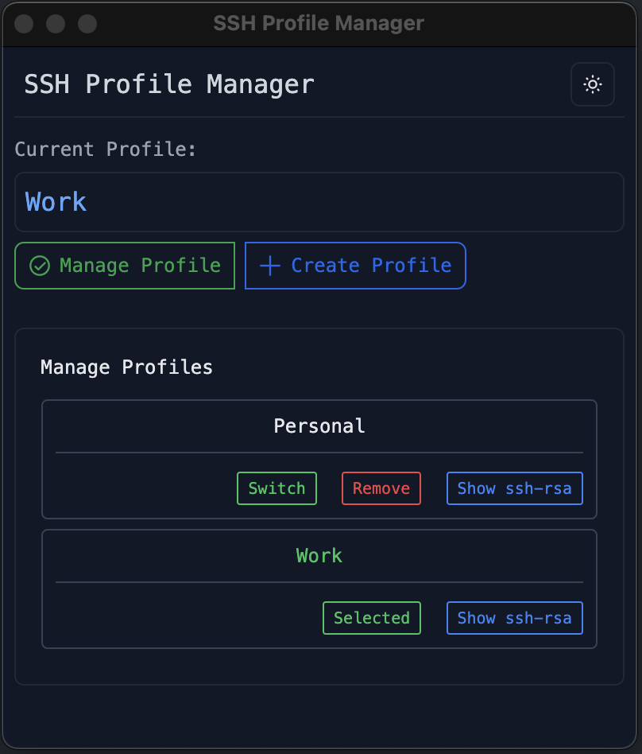

# SSH Profile Manager

A desktop application for easily managing multiple SSH profiles and GitHub configurations.

## Features

- Create and manage multiple SSH profiles
- Switch between different SSH configurations with one click
- View and copy SSH public keys
- Optional GitHub token integration
- Dark/Light theme support
- User-friendly interface

## Screenshots

## Installation

1. Download the latest release from the releases page
2. Install the application for your operating system
3. Launch SSH Profile Manager

## Usage

1. Click "Create Profile" to add a new SSH profile
2. Fill in the required information:
   - Profile Name
   - Full Name
   - GitHub Username 
   - Email
   - GitHub Token (Optional)
3. Use the "Switch" button to activate a profile
4. View SSH public keys using the "Show ssh-rsa" button
5. Copy SSH public keys using the "Copy" button
6. Remove unwanted profiles with the "Remove" button

## Important

- This application is designed to work on macOS and Linux.
- The application you to copy the ssh-rsa key and add it to your GitHub account.

## Development

Built with:
- Electron
- TypeScript
- TailwindCSS

## Author

**Zemichael**
- LinkedIn: [linkedin.com/in/zemichaelmd](https://linkedin.com/in/zemichaelmd)
- GitHub: [github.com/zemichaelmd](https://github.com/zemichaelmd)

## License

This project is licensed under the MIT License - see the LICENSE file for details.
